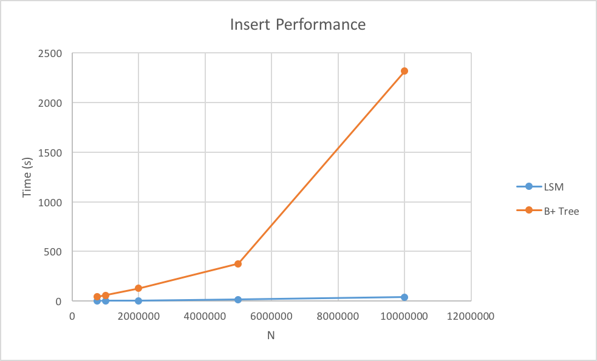
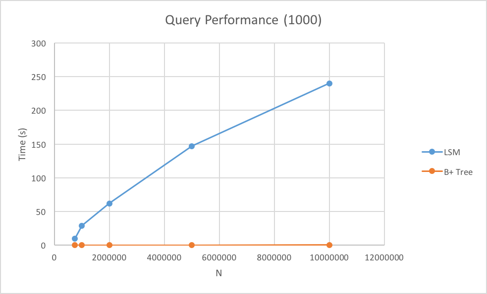
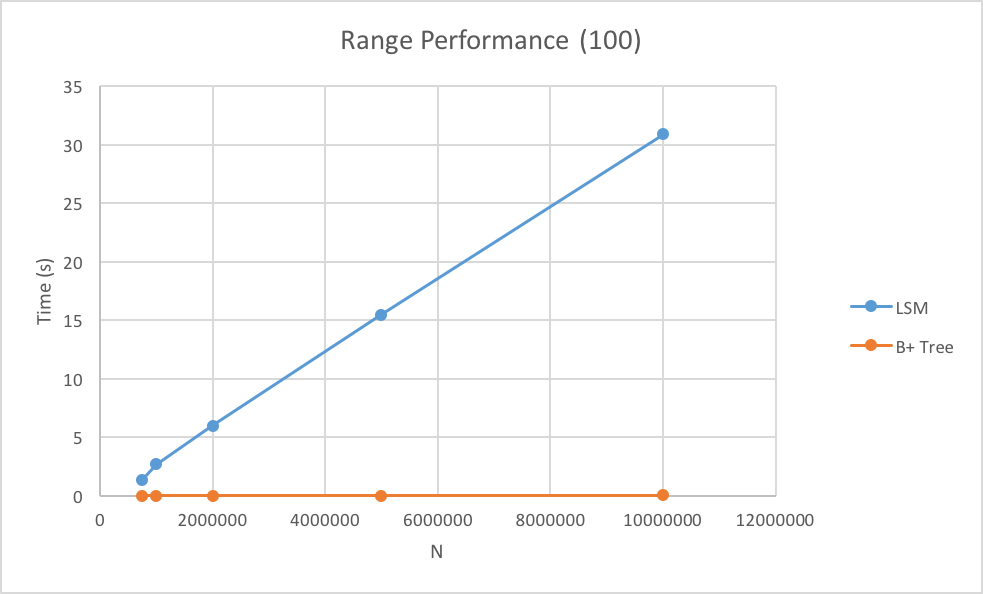

## LSM Tree:
### Faster Write Storage for Databases

---

## Overview of Project
- Java was used to implement a LSM tree and compare its performance to an open-source B+ tree implementation
- Reference Tree
- Implemented LSM Tree
- Results
- Analysis

---

## Reference B+ Tree
- bplustreedotnet Project
- Project page can be found at http://bplusdotnet.sourceforge.net
- Written in C#, Java, and Python
- Uses strings as both key and value
- One of the only open source implementations of B+ tree on disk

---

## My LSM Tree
- Written in Java
- Supported Key, Value pairs of two Longs (-2^63, 2^63 - 1)
- C0 level cache uses the Standard Library Red-Black Tree
- C1 and C2 level caches store data serially
- Data is stored on disk using Google's ProtocolBuffers
- No caching supported

---

## My LSM Tree
- Available methods:
  - get(key)
  - put(key, value)
  - delete(key)
  - close()

---

## Protocol Buffers
- Created by Google as a way to serialize data cross-platform and efficiently
- Uses a special DSL to write .proto files to specify Protocol
- Generator then generates language-specific files
  - Supported languages include C++, C#, Go, Java, Python and Node
- High performance compared to Java's included Serialization mechanism
  - Does not include Object information
  - Write binary data, very fast parsing

---

## Benchmark Methodology
- Generated Longs (-2^63, 2^63 - 1) in Java.
- Each Long in Java has a size of 16 bytes
- Dataset was inserted into each of the databases
- 1000 Random Queries were run against each database
- Range query of 100 elements were run against each database
- C0 Size = 500,000
- C1 Size = 6,000,000

---

## Benchmarks (25,000,000 elements)
|              | LSM Tree | B+ Tree    |
|:---          | :------------- | :------------- |
| Insert       | 105.8       | > 1000 |
| Get (100)    | 235.1       | unknown |
| Range (100)  | 297.9       | unknown |

_B+ Tree storage file size was 5.7 GB at stop time (1000 seconds)_  
_Total LSM Storage was 250 MB_

---

## Insert Benchmark

---

## Query Benchmark

---

## Range Benchmark

---

## Benchmark Data

| N        | LSM Insert | LSM Get | LSM Range | B+ Insert | B+ Get | B+ Range |
|:-------- |:-----------|---------|-----------|-----------|--------|----------|
| 750000   | 1.813      | 9.855   | 1.35      | 41.974    | 0.034  | 0.001    |
| 1000000  | 3.137      | 29.188  | 2.707     | 57.362    | 0.106  | 0.002    |
| 2000000  | 4.862      | 61.793  | 5.99      | 127.702   | 0.204  | 0.002    |
| 5000000  | 16.54      | 146.884 | 15.481    | 376.943   | 0.202  | 0.002    |
| 10000000 | 39.936     | 239.919 | 30.906    | 2312.523  | 0.633  | 0.025    |

---

## Caveats
- Google's Protocol buffers were not built for large-scale data Serialization
- 2nd Level Disk Data Storage had to be completely read into memory in order to find data stored within it.
  - 80% of data stored in this layer, so it is often necessary to go to this level to find data

---

## Analysis
- My implementation is efficient, but not very scalable with queries
- Even though B+ tree was overall slower, its range and general get times were equivalent to the LSM Tree, meaning that by comparison these operations were faster
- Characteristics remain true to what we studied in class

---

## What I Learned
- B+ data structure
- Serializing and writing data to the disk
- Dealing with permanent data storage
- VisualVM for optimization of my implementation
- Database development is very difficult and nuanced

---

## Future improvements to LSM Tree
- Generalize structure for any data type
- Batch delete operations
- Batch get operations based on demand (timeout)
- Keep cache of recently accessed data (LRU or LIRS)

---

## Batch Mode Queries (N = 1,000,000)
|                | Get (1000)          | Range (1000)  |
| :------------- | :-------------      | :------------ |
| LSM            | 30.468              | 27.01         |
| LSM (Batch)    | 1.054               | 2.126         |
| B+             | 0.185               | 0.017         |

---

## Questions?
